<picture>
  <source media="(prefers-color-scheme: dark)" srcset="./assets/banner-dark.svg">
  <source media="(prefers-color-scheme: light)" srcset="./assets/banner-light.svg">
  
</picture>

<p align="center">
  <a href="./LICENSE"></a>
  <a href="https://github.com/DeutscheModelUnitedNations/munify-chase/releases/latest"></a>
  <a href="https://hub.docker.com/r/deutschemodelunitednations/chase"></a>
  <a href="https://munify.cloud/chase"></a>
  <a href="#stack"></a>
</p>

<p align="center">
  <b><a href="#what-chase-does">Features</a></b> &nbsp;·&nbsp;
  <b><a href="#it-keeps-working-when-the-wi-fi-doesnt">Offline</a></b> &nbsp;·&nbsp;
  <b><a href="#self-host-it">Self-host</a></b> &nbsp;·&nbsp;
  <b><a href="#desktop-app">Desktop app</a></b> &nbsp;·&nbsp;
  <b><a href="#stack">Stack</a></b> &nbsp;·&nbsp;
  <b><a href="#documentation">Docs</a></b> &nbsp;·&nbsp;
  <b><a href="#contributing">Contributing</a></b>
</p>

<br>

<table>
<tr>
<td width="50%" valign="top" align="center">

### ▶ &nbsp;Try it right now

No account. No install. No waiting for a reply.<br>
CHASE runs a full conference **entirely in your browser**.

**[Open the offline demo →](https://chase.munify.cloud/app/localconference/mission-control)**

</td>
<td width="50%" valign="top" align="center">

### ✉ &nbsp;Can't self-host?

We host and operate CHASE **for your conference** —<br>
especially suited for smaller events.

**[vorstand@dmun.de →](mailto:vorstand@dmun.de)**

</td>
</tr>
</table>

<br>

> **CHASE** — _CHAiring SoftwarE_ — is the debate management tool of the **MUNify** project by
> [Deutsche Model United Nations (DMUN) e.V.](https://dmun.de), the German non-profit behind
> MUN-SH, MUNBW and MUNBB. It has been chairing real conferences since long before it had this README.

<picture>
  <source media="(prefers-color-scheme: dark)" srcset="./assets/divider-dark.svg">
  <source media="(prefers-color-scheme: light)" srcset="./assets/divider-light.svg">
  
</picture>

## What CHASE does

<picture>
  <source media="(prefers-color-scheme: dark)" srcset="./assets/features-dark.svg">
  <source media="(prefers-color-scheme: light)" srcset="./assets/features-light.svg">
  
</picture>

Paper speakers' lists, a laptop with a stopwatch, a shared document that three delegations edit at
once, and a chair counting raised placards. CHASE replaces all four — for the chairs running the
debate _and_ for the delegates sitting in it, on the same screen, at the same second.

<table>
<tr>
<th width="33%" align="left">For chairs</th>
<th width="33%" align="left">For participants</th>
<th width="33%" align="left">For admins</th>
</tr>
<tr>
<td valign="top">

Run speakers' and comment lists, recognise motions, open roll-call and simple votes, review
amendments, put a resolution on the big screen, and track who is in the room.

**[Chair guide →](https://munify.cloud/chase/user-manual/chair/getting-started)**

</td>
<td valign="top">

Follow the debate live, put yourself on the list, file motions and requests, draft resolutions
with other delegations, and vote from your own device.

**[Participant guide →](https://munify.cloud/chase/user-manual/participant/getting-started)**

</td>
<td valign="top">

Set up committees and agenda items, import a whole conference from DELEGATOR, configure the
rules of procedure, and watch every committee at once from Mission Control.

**[Admin guide →](https://munify.cloud/chase/user-manual/admin/getting-started)**

</td>
</tr>
</table>

<picture>
  <source media="(prefers-color-scheme: dark)" srcset="./assets/divider-dark.svg">
  <source media="(prefers-color-scheme: light)" srcset="./assets/divider-light.svg">
  
</picture>

## It keeps working when the Wi-Fi doesn't

<picture>
  <source media="(prefers-color-scheme: dark)" srcset="./assets/offline-dark.svg">
  <source media="(prefers-color-scheme: light)" srcset="./assets/offline-light.svg">
  
</picture>

Conference venues have famously bad networks. CHASE is built offline-first, so a dropped
connection is an inconvenience, not a stopped debate:

- **Optimistic mutations** — the UI updates the moment a chair acts, not when the server answers.
- **IndexedDB persistence** — the cache survives reloads, and queued changes replay on reconnect.
- **Cross-tab sync** — the chair view, the presentation screen and a second tab stay consistent.
- **Client-generated IDs** — nanoid on the client, authoritative state on the server.
- **A fully local mode** — an entire conference can run on one device, with no server at all.

<picture>
  <source media="(prefers-color-scheme: dark)" srcset="./assets/divider-dark.svg">
  <source media="(prefers-color-scheme: light)" srcset="./assets/divider-light.svg">
  
</picture>

## Self-host it

<picture>
  <source media="(prefers-color-scheme: dark)" srcset="./assets/install-dark.svg">
  <source media="(prefers-color-scheme: light)" srcset="./assets/install-light.svg">
  
</picture>

```bash
git clone https://github.com/DeutscheModelUnitedNations/munify-chase.git
cd munify-chase
docker compose -f example/docker-compose.yml up -d
```

Then point `ORIGIN` at your public URL and plug in your identity provider.

### What you need to bring

| Requirement            | Why                                   | Notes                                           |
| ---------------------- | ------------------------------------- | ----------------------------------------------- |
| **PostgreSQL**         | All conference state                  | Included in the example compose file            |
| **An OIDC provider**   | CHASE ships **no built-in auth**      | See recommendations below                       |
| **A public origin**    | OIDC redirects and WebSockets         | `ORIGIN=https://chase.example.org`              |
| **Redis** _(optional)_ | Subscription fan-out across instances | Only needed when running more than one instance |

<details>
<summary><b>Choosing an identity provider</b></summary>

<br>

CHASE has no built-in authentication — it delegates entirely to an OIDC-compliant provider. If you
don't already run one:

| Provider                                                | Good for                                            |
| ------------------------------------------------------- | --------------------------------------------------- |
| [**pocket-id**](https://github.com/pocket-id/pocket-id) | Small conferences, passkey-only, trivial to run     |
| [**Zitadel**](https://zitadel.com/)                     | Self-hosted, full-featured, organisations and roles |
| [**Logto**](https://logto.io/)                          | Managed or self-hosted, confidential clients        |

Your provider must allow these redirect URIs:

```
https://<your-origin>/auth/login-callback
https://<your-origin>/auth/logout-callback
```

Relevant environment variables:

| Variable                                           | Purpose                                                      |
| -------------------------------------------------- | ------------------------------------------------------------ |
| `PUBLIC_OIDC_AUTHORITY`                            | Discovery URL (the full `/.well-known/openid-configuration`) |
| `PUBLIC_OIDC_CLIENT_ID`                            | Application client ID                                        |
| `OIDC_CLIENT_SECRET`                               | Required for confidential clients                            |
| `OIDC_SCOPES` / `OIDC_ROLE_CLAIM`                  | Scopes and the JWT claim path holding roles                  |
| `ADMIN_EMAIL_WHITELIST` / `ADMIN_DOMAIN_WHITELIST` | Who gets admin access                                        |

The full, authoritative list of options lives in [`src/lib/config/`](./src/lib/config) — every
variable is validated with Zod at boot, so a typo fails loudly instead of silently.

</details>

<details>
<summary><b>Works well with MUNify DELEGATOR</b></summary>

<br>

[**MUNify DELEGATOR**](https://github.com/DeutscheModelUnitedNations/munify-delegator) handles
registration and participant management. CHASE can import an entire conference from it — committees,
delegations, seats and participants in one pass — or run completely standalone if you'd rather
enter everything by hand.

</details>

<details>
<summary><b>Optional: AI-assisted amendment review</b></summary>

<br>

CHASE can help chairs triage amendments. It is entirely optional and off unless configured, and it
comes in two flavours:

- **In the browser** — a quantised model runs locally via WebGPU (`@mlc-ai/web-llm`). Nothing
  leaves the delegate's device; CHASE probes the GPU and picks a model tier that fits the hardware.
- **On the server** — bring your own provider through `AI_PROVIDERS`. Anthropic, OpenAI, Google,
  Azure, Bedrock, Mistral, Groq, Cohere, DeepSeek, xAI and any OpenAI-compatible endpoint are wired up.

</details>

<picture>
  <source media="(prefers-color-scheme: dark)" srcset="./assets/divider-dark.svg">
  <source media="(prefers-color-scheme: light)" srcset="./assets/divider-light.svg">
  
</picture>

## Desktop app

CHASE also ships as a Tauri-based native client — useful when a committee room has no reliable
network at all, or when the chair simply wants an app in the dock.

<p align="center">
  <a href="https://github.com/DeutscheModelUnitedNations/munify-chase/releases/latest">
    
  </a>
  <br>
  <sub>Opens the latest release — the installers are under <b>Assets</b>.</sub>
</p>

| Platform | Artifact             |
| -------- | -------------------- |
| macOS    | `.dmg`               |
| Windows  | `.exe`               |
| Linux    | `.deb` · `.AppImage` |

<details>
<summary><b>How the desktop build works</b></summary>

<br>

The app is built from the `native-client` branch — a server-free fork of `main`. A workflow merges
`main` into `native-client` on every commit, strips the server-only files, and either pushes
directly or opens a PR when there are conflicts. Version tags trigger the release build, which is
published to the same GitHub release as the Docker image.

</details>

<picture>
  <source media="(prefers-color-scheme: dark)" srcset="./assets/divider-dark.svg">
  <source media="(prefers-color-scheme: light)" srcset="./assets/divider-light.svg">
  
</picture>

## Stack

<picture>
  <source media="(prefers-color-scheme: dark)" srcset="./assets/stack-dark.svg">
  <source media="(prefers-color-scheme: light)" srcset="./assets/stack-light.svg">
  
</picture>

The database schema is the single source of truth. [Rumble](https://github.com/m1212e/rumble)
generates the GraphQL schema, resolvers and ability-based access control straight from the Drizzle
table definitions, and the typed client is generated from that — so a column rename surfaces as a
type error in a Svelte component rather than a runtime surprise during a debate.

<details>
<summary><b>Getting a dev environment running</b></summary>

<br>

**Requirements:** [Bun](https://bun.sh), Docker, Node.js

```bash
bun i                    # install dependencies
cp .env.example .env     # configure environment
bun run dev              # dev server + containers + seed-schema codegen
```

|            |                                            |
| ---------- | ------------------------------------------ |
| App        | `http://localhost:5173`                    |
| PostgreSQL | `localhost:5432` — `postgres` / `postgres` |
| Mock OIDC  | `localhost:8080`                           |

**Everyday commands**

```bash
bun run dev              # everything, concurrently
bun run dev:server       # dev server only (containers must be running)

bun run check            # svelte-check
bun run typecheck        # tsc --noEmit
bun run lint             # eslint
bun run format           # prettier --write
bun run test             # vitest

bun run db:push          # push schema changes
bun run db:migrate       # run migrations
bun run db:seed:dev      # seed from dev.yaml
bun run db:studio        # Drizzle Studio
bun run db:nuke          # drop the volume and migrate from scratch

bun run i18n:check       # compare message keys across locales
bun run machine-translate  # fill in missing translations
```

**Where things live**

| Path                    | What's there                                                |
| ----------------------- | ----------------------------------------------------------- |
| `src/api/db/schema.ts`  | Drizzle tables — the source of truth                        |
| `src/api/handlers/`     | GraphQL types, abilities, queries, mutations, subscriptions |
| `src/api/rumble.ts`     | Schema construction, Yoga and WebSocket server factories    |
| `src/lib/api/client.ts` | urql client and the offline exchange chain                  |
| `src/lib/components/`   | Svelte 5 components (runes, not stores)                     |
| `src/routes/app/`       | The application itself                                      |
| `messages/`             | `de` · `en` · `pt` translations                             |

Generated and not to be hand-edited: `schema.graphql`, `src/lib/api/rumbleClient/`,
`src/lib/paraglide/`, `drizzle/`.

</details>

<picture>
  <source media="(prefers-color-scheme: dark)" srcset="./assets/divider-dark.svg">
  <source media="(prefers-color-scheme: light)" srcset="./assets/divider-light.svg">
  
</picture>

## Documentation

Setup guides, self-hosting, the user manual and FAQs live at **[munify.cloud](https://munify.cloud/chase)**.

<p align="center">
  <a href="https://munify.cloud/chase/selfhost/getting-started"><b>Self-hosting</b></a> &nbsp;·&nbsp;
  <a href="https://munify.cloud/chase/user-manual/introduction"><b>User manual</b></a> &nbsp;·&nbsp;
  <a href="https://munify.cloud/chase/faq"><b>FAQ</b></a>
</p>

## Contributing

Contributions are welcome — see [CONTRIBUTING.md](./CONTRIBUTING.md). CHASE is written by people who
also chair the conferences it runs, so bug reports from the committee floor are especially valuable.

By contributing you agree to release your work under the project's license.

<details>
<summary><b>Releasing</b></summary>

<br>

```bash
npm version patch   # 1.2.3 → 1.2.4
npm version minor   # 1.2.3 → 1.3.0
npm version major   # 1.2.3 → 2.0.0

git push --follow-tags
```

Pre-release tags (`alpha`, `beta`, `rc`) are published as GitHub pre-releases and excluded from the
auto-updater.

</details>

## License

[**AGPL-3.0**](./LICENSE) — free to use, free to self-host, free to fork. If you run a modified
version as a network service, share your changes.

## Support the project

CHASE is built and maintained by volunteers of a German non-profit. If it saved your conference a
stack of paper, consider [donating to DMUN e.V.](https://dmun.de) — donations are tax-deductible in
Germany — or reach out at [vorstand@dmun.de](mailto:vorstand@dmun.de).

<picture>
  <source media="(prefers-color-scheme: dark)" srcset="./assets/divider-dark.svg">
  <source media="(prefers-color-scheme: light)" srcset="./assets/divider-light.svg">
  
</picture>

<p align="center">
  <sub>Built with care by <a href="https://dmun.de"><b>Deutsche Model United Nations e.V.</b></a> · part of the <b>MUNify</b> project</sub>
  <br>
  <sub><a href="https://github.com/DeutscheModelUnitedNations/munify-delegator">DELEGATOR</a> — registration &amp; participant management &nbsp;·&nbsp; <b>CHASE</b> — chairing software</sub>
</p>
