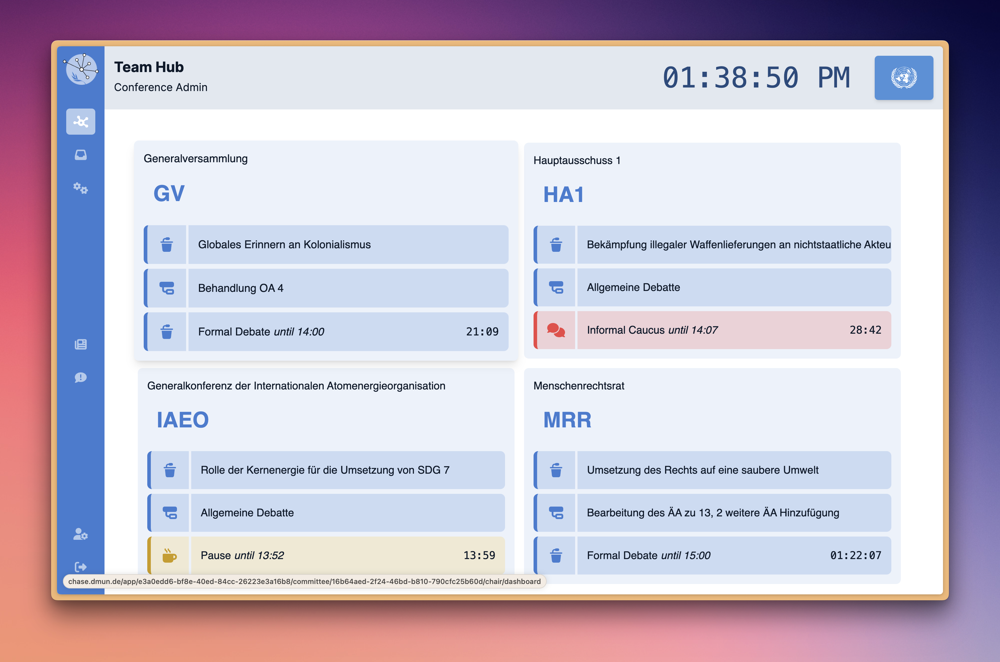
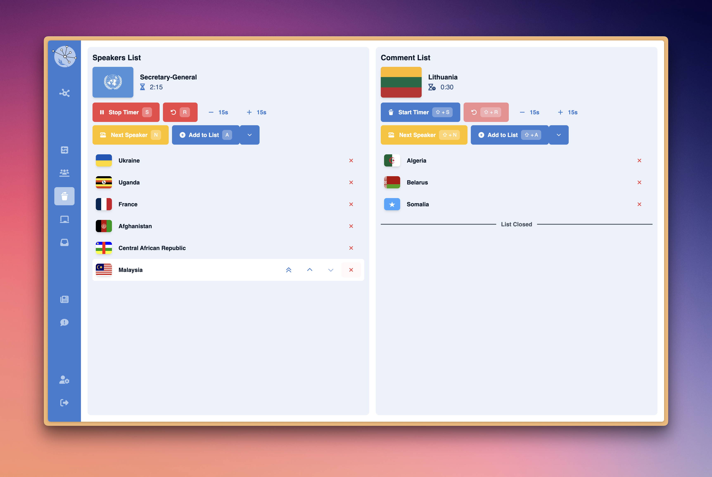

# CHASE (CHAiring SoftwarE)

CHASE is the part of MUNify which is used directly on the conferences. It contains frontend and backend for the on conference application and allows to do things like managing speakerlists, voting or writing papers. See the respective folders for more details on the implementation.

The App has two layers of access. Team members can access the Mission Control and manage the conference. Delegates can access the Delegate App and participate in the conference.

## Features

### Mission Control

- [X] Committee Status Overview

### Per Committee

- [X] Attendance tracking
- [X] Speakerlist
- [X] Send Messages to the Chair
- [X] Send Messages to Research Service
- [X] Status Reporting
- [ ] Resolution editing/sharing (work in progress)
- [ ] Voting

### Research Service

- [X] View and manage research requests from chairs and delegates

### Admin Panel

- [X] Manage Committees
- [X] Manage Delegations
- [ ] Manage Non-State Actors

### Other

- [ ] Guest Panel (work in progress)
- [ ] Non-State Actors Panel (work in progress)

## Code Structure
The code for CHASE is split into two parts. The `frontend` and the `backend`. The [`frontend`](./frontend) is a [React](https://reactjs.org/)/[NEXT.js](https://nextjs.org/) application and the [`backend`](./backend) is currently being transformed to a [GraphQL](https://graphql.org/) API.

## Impressions

